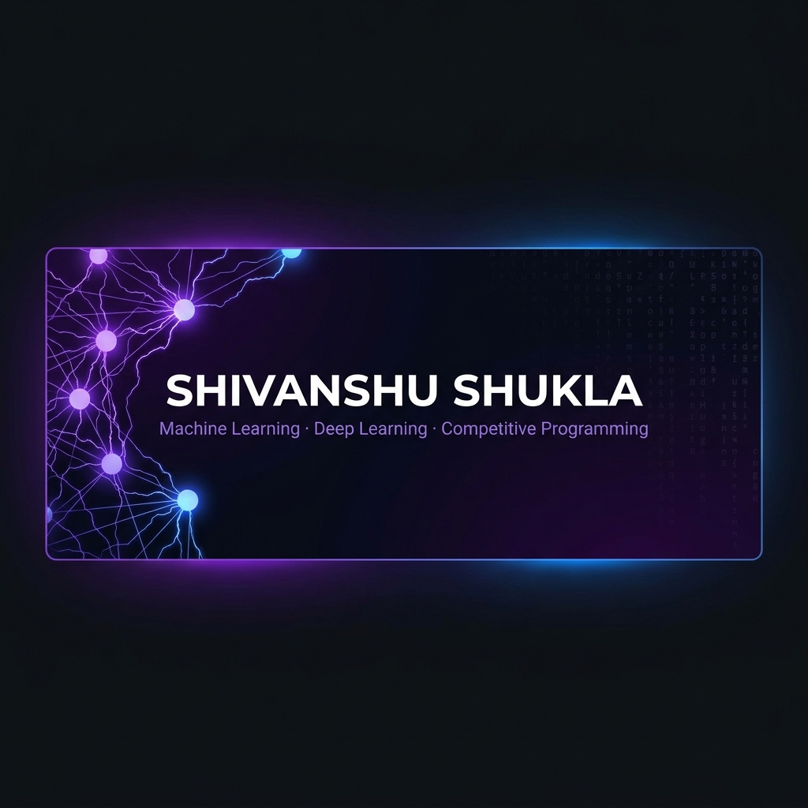
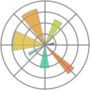
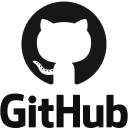

<!-- ═══════════════════════════════════════════════════════════════ -->
<!--                        BANNER                                  -->
<!-- ═══════════════════════════════════════════════════════════════ -->
<div align="center">
  
</div>

<br/>

<!-- ═══════════════════════════════════════════════════════════════ -->
<!--                     TYPING ANIMATION                           -->
<!-- ═══════════════════════════════════════════════════════════════ -->
<div align="center">
  <a href="https://github.com/shivanshu1512">
    
  </a>

  <br/><br/>

  
  &nbsp;
  
  &nbsp;
  <a href="https://www.linkedin.com/in/shivanshu-shukla-7aa482327">
    
  </a>
  &nbsp;
  <a href="mailto:meshivanshu1512@gmail.com">
    
  </a>
</div>

---

<!-- ═══════════════════════════════════════════════════════════════ -->
<!--                    GITHUB STATISTICS                           -->
<!-- ═══════════════════════════════════════════════════════════════ -->

## 📊 GitHub Statistics

<div align="center">
  
  &nbsp;
  
</div>

<div align="center">
  
</div>

<div align="center">
  
</div>

---

<!-- ═══════════════════════════════════════════════════════════════ -->
<!--                       ABOUT ME                                 -->
<!-- ═══════════════════════════════════════════════════════════════ -->

## 🧬 About Me

```python
class Shivanshu:
    def __init__(self):
        self.name            = "Shivanshu Shukla"
        self.focus           = ["Machine Learning", "Deep Learning", "Competitive Programming"]
        self.frameworks      = ["PyTorch", "TensorFlow", "Keras", "Scikit-Learn"]
        self.cp_handles      = {"Codeforces": "shukla_1512", "LeetCode": "Shivanshu1512"}
        self.current_focus   = "PyTorch — custom training loops, datasets & autograd"
        self.next_goals      = ["NLP & Transformers", "Computer Vision", "RL with PyTorch"]
        self.fun_fact        = "I find debugging neural nets more satisfying than life itself 🧠"

    def say_hi(self):
        print("Thanks for stopping by! Let's build something intelligent. 🚀")

me = Shivanshu()
me.say_hi()
```

---

<!-- ═══════════════════════════════════════════════════════════════ -->
<!--                      TECH STACK                                -->
<!-- ═══════════════════════════════════════════════════════════════ -->

## 🛠️ Tech Stack

### 🤖 Machine Learning & Deep Learning

<p align="left">
  &nbsp;&nbsp;
  &nbsp;&nbsp;
  &nbsp;&nbsp;
  &nbsp;&nbsp;
  &nbsp;&nbsp;
  &nbsp;&nbsp;
  &nbsp;&nbsp;
  &nbsp;&nbsp;
  &nbsp;&nbsp;
  &nbsp;&nbsp;
  
</p>

### ⚡ Competitive Programming & Tools

<p align="left">
  &nbsp;&nbsp;
  &nbsp;&nbsp;
  &nbsp;&nbsp;
  &nbsp;&nbsp;
  
</p>

---

<!-- ═══════════════════════════════════════════════════════════════ -->
<!--                   ML / DL ROADMAP                              -->
<!-- ═══════════════════════════════════════════════════════════════ -->

## 🗺️ ML / DL Learning Roadmap

| Phase | Topics | Progress | Status |
|:-----:|:-------|:--------:|:------:|
| 📐 **Foundations** | NumPy · Pandas · Matplotlib · Seaborn | `████████████████████` 100% | ✅ Complete |
| 🤖 **Classical ML** | Regression · Classification · Clustering · Feature Engineering | `████████████████████` 100% | ✅ Complete |
| 🧠 **Deep Learning** | ANNs · CNNs · RNNs · Transformers · Backprop | `████████████████████` 100% | ✅ Complete |
| 🔥 **PyTorch** | Tensors · Autograd · Custom Loops · Datasets | `████████░░░░░░░░░░░░` 40% | 🔥 Active |
| 🌐 **NLP** | Tokenization · Word2Vec · BERT · LLMs | `░░░░░░░░░░░░░░░░░░░░` 0% | 📅 Up Next |
| 👁️ **Computer Vision** | YOLO · Segmentation · GANs | `░░░░░░░░░░░░░░░░░░░░` 0% | 📅 Planned |
| 🎮 **Reinforcement Learning** | Q-Learning · DQN · Policy Gradient | `░░░░░░░░░░░░░░░░░░░░` 0% | 📅 Planned |

---

<!-- ═══════════════════════════════════════════════════════════════ -->
<!--                 COMPETITIVE PROGRAMMING                        -->
<!-- ═══════════════════════════════════════════════════════════════ -->

## ⚡ Competitive Programming

<div align="center">

  <a href="https://codeforces.com/profile/shukla_1512">
    
  </a>
  &nbsp;&nbsp;
  <a href="https://leetcode.com/u/Shivanshu1512/">
    
  </a>

</div>

<br/>

<div align="center">

| 🔁 Algorithms | 🌲 Data Structures | 🔢 Math & Theory |
|:---:|:---:|:---:|
| Dynamic Programming | Segment Trees | Number Theory |
| Graph Algorithms (BFS / DFS / Dijkstra / Floyd) | Fenwick Trees (BIT) | Combinatorics |
| Binary Search & Two Pointers | Union-Find (DSU) | Modular Arithmetic |
| Greedy & Constructive | Heaps & Priority Queues | Prime Sieve (Eratosthenes) |
| Backtracking & Recursion | Tries & Hashing | Game Theory |
| Bit Manipulation | Monotonic Stack / Deque | Matrix Exponentiation |

</div>

---

<!-- ═══════════════════════════════════════════════════════════════ -->
<!--                       TROPHIES                                 -->
<!-- ═══════════════════════════════════════════════════════════════ -->

## 🏆 GitHub Trophies

<div align="center">
  
</div>

---

<!-- ═══════════════════════════════════════════════════════════════ -->
<!--                     CONNECT                                    -->
<!-- ═══════════════════════════════════════════════════════════════ -->

## 📫 Connect With Me

<div align="center">

  <a href="mailto:meshivanshu1512@gmail.com">
    
  </a>
  &nbsp;
  <a href="https://www.linkedin.com/in/shivanshu-shukla-7aa482327">
    
  </a>
  &nbsp;
  <a href="https://github.com/shivanshu1512">
    
  </a>
  &nbsp;
  <a href="https://codeforces.com/profile/shukla_1512">
    
  </a>
  &nbsp;
  <a href="https://leetcode.com/u/Shivanshu1512/">
    
  </a>

</div>

<br/>

<div align="center">
  
  <br/>
  <i>⭐️ "The best way to understand intelligence is to build it." — Every ML engineer ever</i>
</div>
